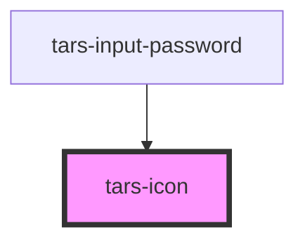

# tars-icon

<!-- Auto Generated Below -->

## Properties

| Property            | Attribute     | Description | Type                                                    | Default     |
| ------------------- | ------------- | ----------- | ------------------------------------------------------- | ----------- |
| `ariaHidden`        | `aria-hidden` |             | `string`                                                | `'true'`    |
| `icon` _(required)_ | `name`        |             | `"ACCESSIBILITY" \| "EYE-OFF-OUTLINE" \| "EYE-OUTLINE"` | `undefined` |
| `size`              | `size`        |             | `"LARGE" \| "MEDIUM" \| "SMALL"`                        | `'SMALL'`   |

## Events

| Event     | Description | Type                   |
| --------- | ----------- | ---------------------- |
| `clicked` |             | `CustomEvent<boolean>` |

## Dependencies

### Used by

 - [tars-input-password](../input-password)

### Graph

----------------------------------------------

*Built with [StencilJS](https://stenciljs.com/)*
