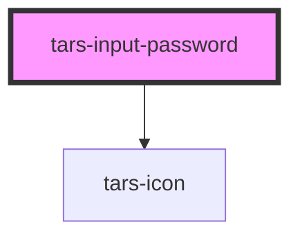

# tars-input-password

<!-- Auto Generated Below -->

## Properties

| Property            | Attribute     | Description      | Type      | Default     |
| ------------------- | ------------- | ---------------- | --------- | ----------- |
| `inputName`         | `name`        |                  | `string`  | `''`        |
| `inputPlaceholder`  | `placeholder` | Set placeholder. | `string`  | `undefined` |
| `isPasswordVisible` | `visible`     |                  | `boolean` | `false`     |
| `value`             | `value`       |                  | `string`  | `undefined` |

## Events

| Event          | Description | Type                   |
| -------------- | ----------- | ---------------------- |
| `showPassword` |             | `CustomEvent<boolean>` |

## Methods

### `getValue() => Promise<string>`

#### Returns

Type: `Promise<string>`

## Dependencies

### Depends on

- [tars-icon](../icon)

### Graph

----------------------------------------------

*Built with [StencilJS](https://stenciljs.com/)*
